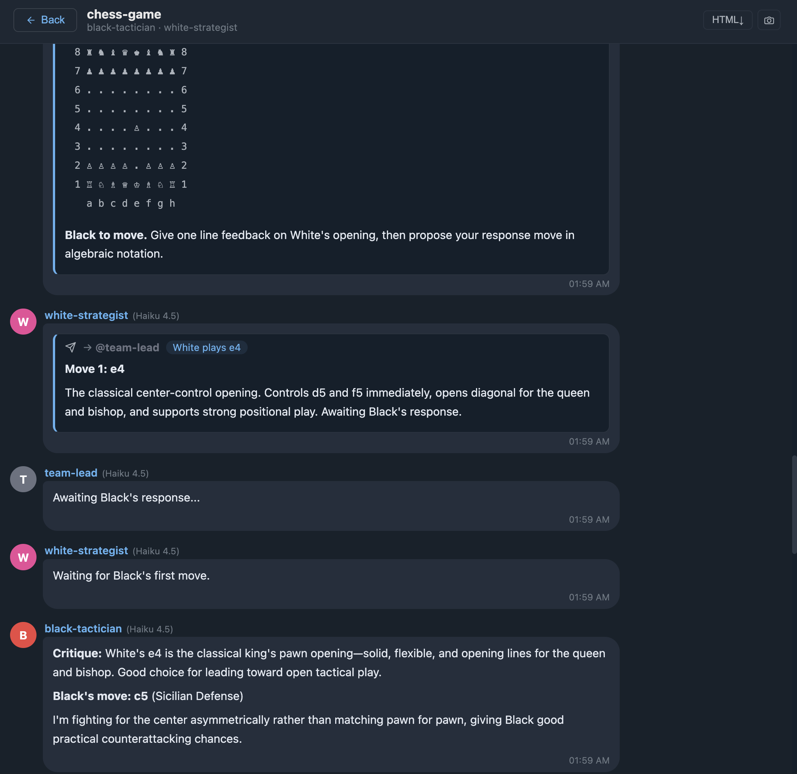

# claude-chatview



`claude-chatview` is a local viewer for Claude Code sessions.

It reads session data from:
- `~/.claude/projects`
- `~/.claude/transcripts`

Then it presents everything in a messenger-style UI, so you can browse, search, and review activity quickly.

## Quick Start

### Run directly (recommended)
```bash
npx claude-chatview
```

Your browser opens automatically at `http://localhost:3001`.

### Global install
```bash
npm i -g claude-chatview
cview
```

## Why Use It?
- Read session history without opening raw JSONL files
- Find recent sessions quickly with search
- Review Agent Teams activity in a single timeline view
- Export selected messages as PNG/JPG

## Features
- Session list and search
- Standard chat session view
- Agent Teams timeline view
- Markdown/code block rendering
- HTML export and message capture (PNG/JPG)

## Optional Configuration
| Variable | Default | Description |
|---|---|---|
| `PORT` | `3001` | Server port |
| `CVIEW_CLAUDE_DIR` | `~/.claude` | Claude data root |

Example:
```bash
PORT=4000 cview
```

## Security
- Runs in local-only mode (`127.0.0.1` loopback)
- Remote exposure (for example `0.0.0.0`) is not supported
- `/api` only allows local IP + local Origin

## Development
```bash
npm install
npm run dev
```

- Frontend (Vite): `http://localhost:5173`
- API (Express): `http://127.0.0.1:3001`

Build:
```bash
npm run build
```

Test:
```bash
npm test
```

## License
MIT
